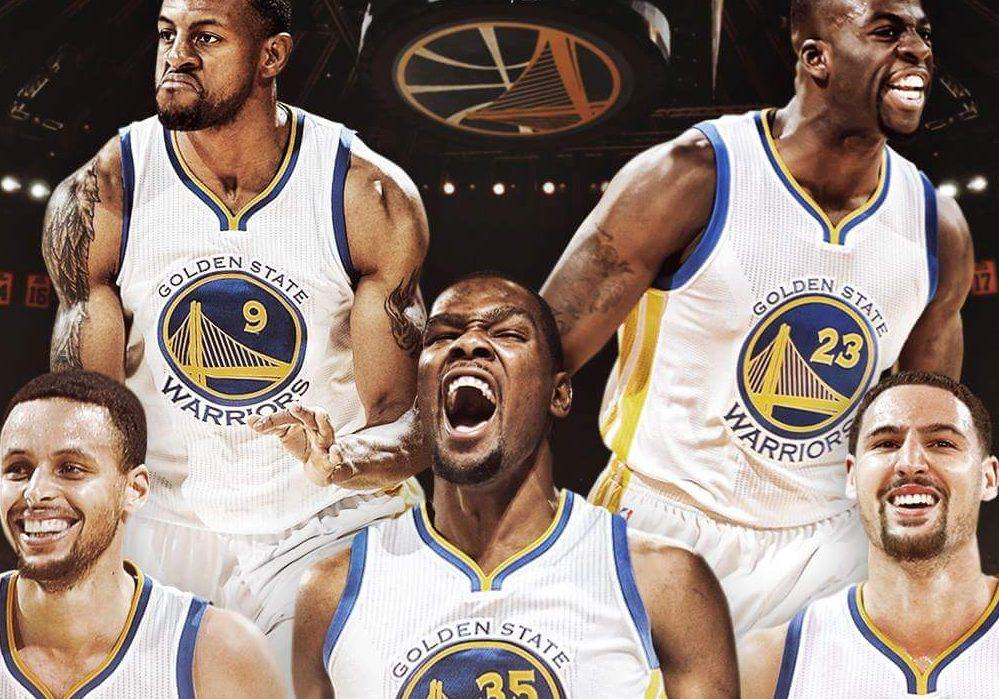
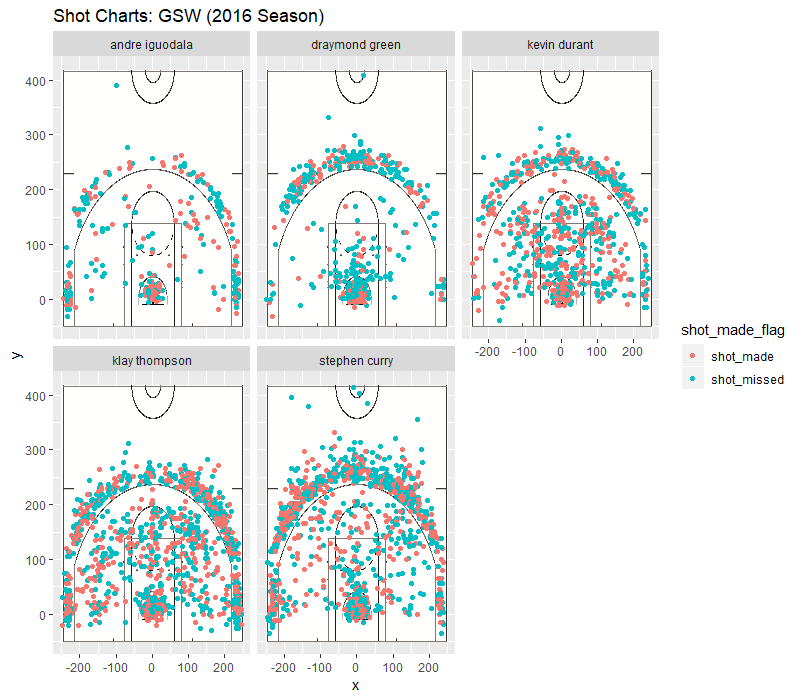

Workout 1
================
Thomas Sperandeo

Workout01 Report: Analyzing Shot Charts and Effective Field Goal % Tables
=========================================================================

Background and Motivation
-------------------------

The Golden State Warriors were in the midst of a historic run in the 2016-2017 NBA season. After breaking the regular season record for wins in a season with 72 the previous year, former NBA MVP and several-time scoring champion Kevin Durant joined the team in free agency to join all-stars Stephen Curry, Draymond Green, Klay Thompson and Andre Iguodala. They would go on to win their second NBA Finals in three years, winning 67 games to only 15 losses in the regular season, demonstrating that this may be the greatest collection of basketball talent on a single team in the history of the NBA.

With that being said, in this article we are going to analyze the shot charts and individual field goal percentages of the five aforementioned stars of the Golden State Warriors in order to truly parse out the greatest difference makers/ most effective shooters on one of the best shooting teams in NBA history. The data we will look at can then be used to identify a way in which other teams can model their shot-selection off of in an effort to mimic a winning formuala.

Looking at Shot Charts
----------------------

Above are the shot charts for the five Warriors' players of focus, with the red dots indicating a made shot and the bluish dots indicating a missed shot. From this graphic right away, we are able to determine the main shot-takers on the team due to the heavier concentration of dots. It is clear that the three main shooters on the team are Stephen Curry, Kevin Durant and Klay Thompson, whereas, Draymond Green and Andre Iguodala are more selective shooters as they serve secondary roles in the offense.

Analyzing 2PT Field Goal %
--------------------------

#### Effective 2PT Shooting Field Goal %

    ##             Name Total Made Perc_Made
    ## 1 Andre Iguodala   210  134  63.80952
    ## 2  Stephen Curry   563  304  53.99645
    ## 3   Kevin Durant   643  390  60.65319
    ## 4  Klay Thompson   640  329  51.40625
    ## 5 Draymond Green   346  171  49.42197

If we are simply looking at the 2PT field goal percentage of these five players, we can see that the most efficient 2PT shooter was Small Forward Andre Iguodala who shot an incredibly efficient 63.8% on 210 attempts. The sample size however, compared to the other players involved in this analysis, seems small which may indicate that Iguodala's efficiency would regress on a larger sample size. A factor which may be a strong indicator that his efficiency is merely more than a anomaly from a small sample size is where the majority of Iguodala's 2PT attempts are located from. Referring the shot charts above, it can seen that, in relation to his teammates, a majority of Iguodala's 2PT attempts are coming directly next to the rim. Shots at the rim, in general, are far more efficient than 2PT jumpshots and most likely explain why Iguodala was more efficient that his counterparts. With this context in mind, Kevin Durant's 2PT efficiency may be more impressive than Iguodala's due to a sample size three times larger and a greater variety of 2PT attempts as shown by a greater spread within the arc. The more spread out distribution of 2PT attempts indicates that Durant is more able to score around the entire floor. While not as impressive as the figures of Iguodala and Durant, Stephen Curry, Klay Thompson and Draymond Green were still relatively efficient on their 2PT attempts as all of them were around the 50% range.

Analyzing 3PT Field Goal%
-------------------------

##### Effective 3PT Shooting Field Goal %

    ##             Name Total Made Perc_Made
    ## 1 Andre Iguodala   161   58  36.02484
    ## 2  Stephen Curry   687  280  40.75691
    ## 3   Kevin Durant   272  105  38.60294
    ## 4  Klay Thompson   580  246  42.41379
    ## 5 Draymond Green   232   74  31.89655

Things become a little bit more interesting when analyzing the 3PT effective field goal percentage of these five Warriors' players. With arguably three of the best 3PT shooters of all time in Stephen Curry, Klay Thompson and Kevin Durant. Looking at the data, we can clearly see where those three garner their reputation as the lowest 3PT percentage is held by Durant with a still remarkably high 38.6% on a decent volume of 272 attempts. Both Curry and Thompson, however, seem to be on another level in terms of their 3PT shooting as both shot over 40%. Thompson's percentage is a few percentage points higher (42.4%) but Curry makes up for it with a higher volume as he made 34 more 3PT shots than Thompson. Nevertheless, it is certain that this trio's incredible efficiency from behind the 3PT arc contributed heavily to their NBA dominance. Andre Iguodala, on a fairly small sample size, was still about average with a 3PT field goal percent of 36. Draymond Green, from the gathered data, appears to be the only liability as a 3PT shooter even though he shot 71 more of them than the more efficient Iguodala. However, as a whole, due to the volume and efficiency with which Golden State was able to score 3PT shots, it is apparent that it was certainly a weapon for their offensive game plan in the 2016 NBA season.

Analyzing Overall Field Goal%
-----------------------------

#### Effective Overall Shooting Field Goal %

    ##             Name Total Made Perc_Made
    ## 1 Andre Iguodala   371  192  51.75202
    ## 2  Stephen Curry  1250  584  46.72000
    ## 3   Kevin Durant   915  495  54.09836
    ## 4  Klay Thompson  1220  575  47.13115
    ## 5 Draymond Green   578  245  42.38754

Now, when we combine the 2PT and 3PT field goal percentages together, we can gather information on the overall efficiency of each player and, hence, determine how much of an offensive impact each of these players made during their championship season. Starting from the bottom of the table, Draymond Green once again has the lowest field goal percentage. This is no surprise as he was at the bottom of both 2PT and 3PT efficiency compared to the others. Surprisingly perhaps, Stephen Curry has the second lowest overall field goal percentage of the five at 46.7%. Although this may be lower than his peers, it is still an efficient overall percentage and may be brought down due to the a higher proportion of 3PT attempts than the other players as 3PT shots are more inefficient but present a greater possible reward. Klay Thompson's shooting figures are quite similar to Curry's as he shot 47.1% overall. His situation is parallel to Curry's, making the already efficient 47.1% figure look even more impressive. Moving up the table, we arrive at Andre Iguodala who shot approximately 51.8% on his field goal attempts. This is undoubtedly an incredible figure for anyone to achieve. However, the figure becomes less impressive when considering Iguodala's minimized role in the offense hinted at by his low total of only 371 total shots. Finally at the top of the table, on a respectable volume, Kevin Durant shot an almost absurd 54.1% overall throughout the course of the 2016 season. While his shot-selection of relying more on 2PT attempts than either Curry or Thompson may widen the gap between Durant and those two, nothing can be taken away from Durant's impressive season.

Conclusion
==========

From this perspective of overall field goal percentage, it can be argued that Durant was possibly the most effective offensive player on the Golden State Warriors during the 2016 NBA season. His overall effective field goal percentage was higher than the other four players by over 2% and almost exactly 7% higher than anyone with a respectable sample size in the group. However, it is important that we do not diminish the immense contributions to the offense by Stephen Curry and Klay Thompson. Their proficiency in 3PT shooting makes them one of the most dangerous backcourt tandems the NBA has ever seen, as evidenced by the record-breaking regular season in the 2015 NBA season. Andre Iguodala, while efficient, and Draymond Green seem to have had the least impact on the team's offensive success. This is due to their relatively clustered shot charts, which shows a lack of offensive variety, and their low number of shot attempts. Despite this, Golden State were able to win the championship, showing that a championship offense only necessarily requires three top-tier scorers.

References
==========

<https://www.nbareligion.com/2017/11/27/problemi-fisici-la-death-lineup-dei-golden-state-warriors/>

<https://www.basketball-reference.com/teams/GSW/2017.html>

<https://github.com/ucb-stat133/stat133-hws/blob/master/data/andre-iguodala.csv>

<https://github.com/ucb-stat133/stat133-hws/blob/master/data/kevin-durant.csv>

<https://github.com/ucb-stat133/stat133-hws/blob/master/data/stephen-curry.csv>

<https://github.com/ucb-stat133/stat133-hws/blob/master/data/klay-thompson.csv>

<https://github.com/ucb-stat133/stat133-hws/blob/master/data/draymond-green.csv>
